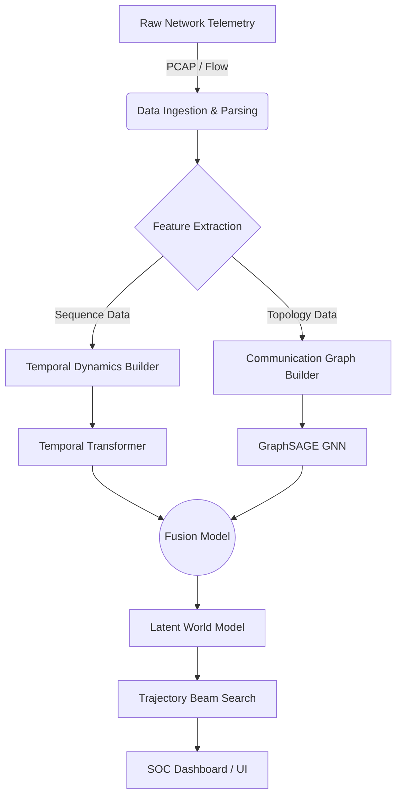
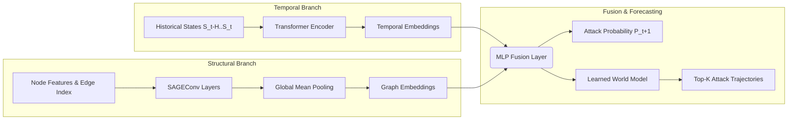
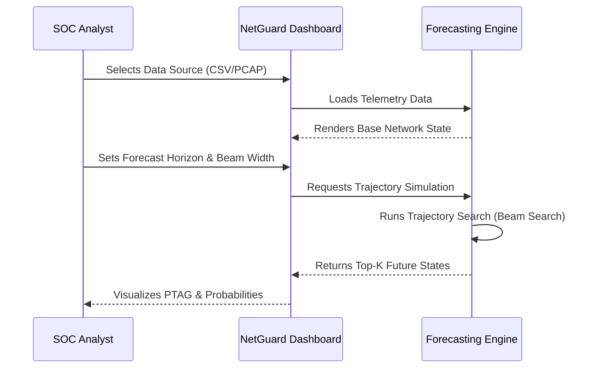

# 🛡️ NETGUARD AI | SOC Forecast

> **See the Next Move. Stop the Breach.**
> 
> *A state-of-the-art AI-driven network attack forecasting system built for modern Security Operations Centers (SOC).*

---

## 🌟 Overview

NETGUARD AI shifts cybersecurity from **reactive to proactive**. Instead of just detecting attacks that are already happening, our platform models the network state, analyzes temporal and structural communication patterns, and **predicts the attacker's future trajectory** before they strike their next target.

Built with a stunning glassmorphic UI, NETGUARD AI provides SOC analysts with a "Control Room" to simulate future network states, evaluate top-k most likely attack paths, and deploy defensive measures ahead of time.

---

## ✨ Key Features

- **🔮 Predictive Threat Attack Graphs (PTAG)**: Generates probabilistic attack paths using a learned world model.
- **⏳ Temporal Transformer Forecaster**: A deep neural sequence model that captures the dynamics of historical network states to forecast future vulnerabilities.
- **🕸️ GraphSAGE Communication Topology**: Utilizes Graph Neural Networks (GNNs) to map out structural network communication and identify critical nodes.
- **🧠 Late-Fusion Architecture**: Intelligently fuses frozen representations from both Temporal Transformers and GraphSAGE models for robust predictions.
- **🚀 Beam Search Trajectory Engine**: Simulates multiple future network states to find the highest-scoring attack trajectories.
- **🎨 Premium iOS-Style Glassmorphic Dashboard**: A fully immersive, dark-mode Control Room built on Streamlit with custom CSS.

---

## 🏗️ Architecture & System Design

NETGUARD AI utilizes a complex multi-modal machine learning architecture, separated into temporal and structural branches before being fused into a unified latent world model.

### 1. High-Level System Architecture



### 2. Machine Learning Pipeline (Late Fusion)



### 3. Dashboard UI Flow



---

## ⚙️ System Design Details

### Data Ingestion Layer
Supports multiple modalities including raw packet captures (PCAP) and aggregated flow telemetry (CSV). The data is parsed into standard schemas representing network entities, traffic statistics, and historical flags.

### Feature Engineering
1. **Temporal Features**: Sliding windows of macro network statistics (e.g., packet rates, bytes transferred).
2. **Structural Features**: Node-level features mapping source-to-destination communications to build an active graph representation of the network.

### Model Architecture
- **Temporal Model**: A 2-layer, 4-head Transformer encoder capturing sequential dependencies.
- **Graph Model**: A multi-layer GraphSAGE network aggregating neighbor features to understand network topology.
- **Fusion Model**: A multi-layer perceptron (MLP) that concatenates frozen embeddings from the temporal and graph branches to predict attack probabilities.

### Inference Engine
Uses a **Learned World Model** to simulate unobserved future states. A **Beam Search** algorithm explores possible future state transitions, pruning low-probability branches, to present the SOC analyst with the most likely sequence of attacker actions.

---

## 🚀 Installation & Setup

1. **Clone the repository**
   ```bash
   git clone https://github.com/CODY-FSAIML/SIH--GHOST-PROTOCOL--2026.git
   cd SIH--GHOST-PROTOCOL--2026
   ```

2. **Install Dependencies**
   ```bash
   pip install -r requirements.txt
   ```

3. **Run the Dashboard**
   ```bash
   streamlit run dashboard/app.py
   ```

4. **Access the Control Room**
   Open your browser and navigate to `http://localhost:8501`.

---

## 🛡️ Built For Hackathons
*This project was developed with a focus on cutting-edge AI research, scalable software engineering, and premium user experience.*
